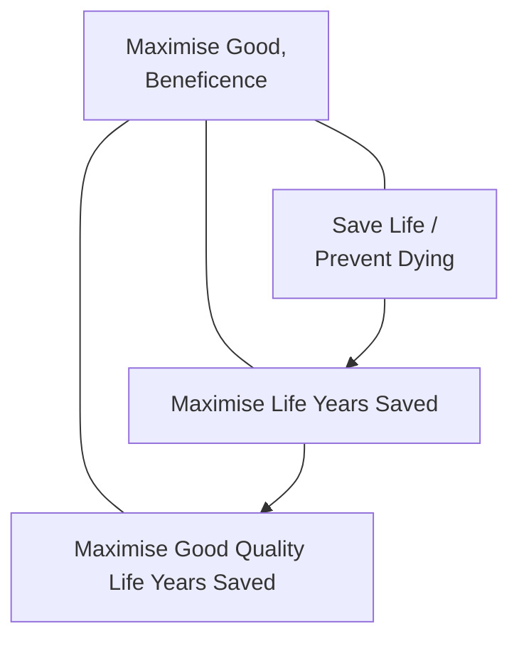

```mermaid
  flowchart TD;
    A[Maximise Good, <br> Beneficence]
    A --- B[Save Life / <br> Prevent Dying]
    A --- C[Maximise Life Years Saved]
        B --> C
    A --- D[Maximise Good Quality Life Years Saved]
      C --> D

```