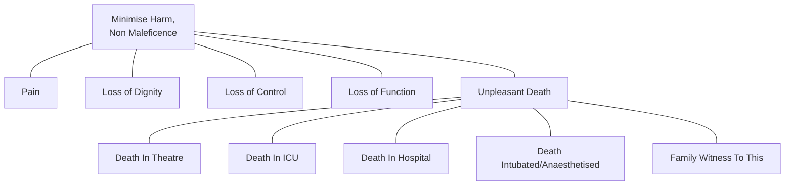

```mermaid
  flowchart TD;
    A[Minimise Harm, <br> Non Maleficence]
    A --- B[Pain]
    A --- C[Loss of Dignity]
    A --- D[Loss of Control]
    A --- E[Loss of Function]
    A --- F[Unpleasant Death]
    F --- G[Death In Theatre]
    F --- H[Death In ICU]
    F --- I[Death In Hospital]
    F --- J[Death Intubated/Anaesthetised]
    F --- K[Family Witness To This]

```