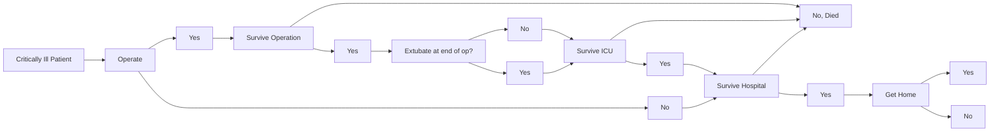

```mermaid
flowchart LR;
    A[Critically Ill Patient]-->B[Operate]
    B-->C[Yes]
    B-->D[No]
    C-->E[Survive Operation]
    E--> F[Yes]
    E--> G[No, Died]
    F--> H[Extubate at end of op?]
    H --> I[Yes]
    H--> J[No]
    J --> K[Survive ICU]
    I --> K[Survive ICU]
    K --> L[Yes]
    K --> G
    L --> N[Survive Hospital]
    N --> O[Yes] & G
    O --> Q[Get Home]
    Q --> R[Yes] & S[No]
    D --> N 
```